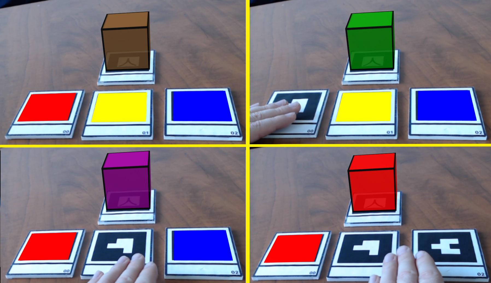

# AR.js-examples

Examples using the AR.js library

The goal of this collection is to provide a set of basic and instructive examples that introduce the various features in the Javascript-based Augmented Reality (AR) library, AR.js (version 2), built upon the <a href="https://aframe.io/">A-Frame</a> and <a href="https://threejs.org/">three.js</a> libraries.

Viewing the AR examples will require a device with a camera and various marker images to be detected, which are available in the <code>markers</code> directory in this repository. Requires the kanji marker unless otherwise specified.

<table class="item-container"><tr>
	<td></td>
	<td class="tableText"><a href="basic.html">Hello, AR World!</a>
	
A basic scene that places plain and textured shapes on markers (kanji, barcodes 0/1/2).
</td>
</tr></table>

<table class="item-container"><tr>
	<td></td>
	<td class="tableText"><a href="models.html">3D model</a>
	
A single gltf model attached to a marker.
</td>
</tr></table>

<table class="item-container"><tr>
	<td></td>
	<td class="tableText"><a href="cubemap.html">Multi-Textured Cube</a>
	
A cube with different images on each side, attached to a marker.  Uses the aframe-multisrc component.
</td>
</tr></table>

<table class="item-container"><tr>
	<td></td>
	<td class="tableText"><a href="animation.html">Animation</a>
	
Animating (rotating) a globe attached to a marker, using the built-in animation component.
</td>
</tr></table>

<table class="item-container"><tr>
	<td></td>
	<td class="tableText"><a href="text.html">Text (2D and 3D)</a>
	
Attaching text to the kanji and hiro markers. 
	3D text uses the aframe-text-geometry component.
</td>
</tr></table>

<table class="item-container"><tr>
	<td></td>
	<td class="tableText"><a href="particles.html">Particle Effects</a>
	
Creating a particle system effect, attached to a marker. 
		 Uses the aframe-particle system component.
</td>
</tr></table>

<table class="item-container"><tr>
	<td></td>
	<td class="tableText"><a href="scripting.html">Introduction to Scripting</a>
	
Rotates a globe attached to a marker, by writing an A-Frame component and modifying the underlying Three.js object.
</td>
</tr></table>

<table class="item-container"><tr>
	<td></td>
	<td class="tableText"><a href="canvas.html">Canvas Textures</a>
	
Using an HTML canvas as the texture for a cube; creating an animation ("bouncing block") on the canvas and updating the cube texture. 
</td>
</tr></table>

<table class="item-container"><tr>
	<td></td>
	<td class="tableText"><a href="detection.html">Detection</a>
	
A cube is attached to a kanji marker. Red, yellow, and blue squares are attached to barcode markers 0, 1, and 2. 
	The color of the cube changes depending on which combination of the markers is visible.
</td>
</tr></table>

<table class="item-container"><tr>
	<td></td>
	<td class="tableText"><a href="follower.html">Persistence and Following </a>
	
A green square is attached to a marker. If the marker is no longer visible, the square turns red and remains in the last known
	position of the marker. If the marker then becomes visible again, the square turns green and moves (lerps) to the new position.
</td>
</tr></table>

<table class="item-container"><tr>
	<td></td>
	<td class="tableText"><a href="line.html">Line between two markers</a>
	
Drawing a line between the centers of barcode markers 0 and 1. (Updates line geometry vertices.)
</td>
</tr></table>

<table class="item-container"><tr>
	<td></td>
	<td class="tableText"><a href="line2.html">Cylinder between two markers</a>
	
Since lines can be difficult to see, drawing spheres at the centers of barcode markers 0 and 1, and creating a cylinder between the them. (Reorients and rescales the cylinder depending on the distance between the markers.)
</td>
</tr></table>

<!-- ### Demos

#### Hello, AR World! 

#### 3D model 

#### Multi-Textured Cube 

#### Animation 

#### Text (2D and 3D)

#### Particle Effects 

#### Introduction to Scripting 

#### Canvas Textures 

#### Detection

#### Persistence and Following

#### Line between two markers 

#### Cylinder between two markers

 -->
